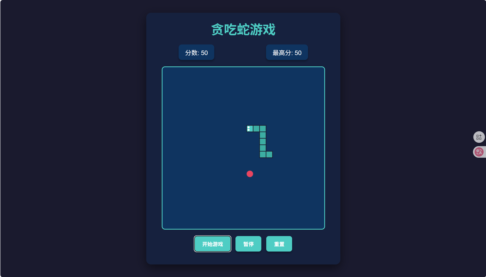
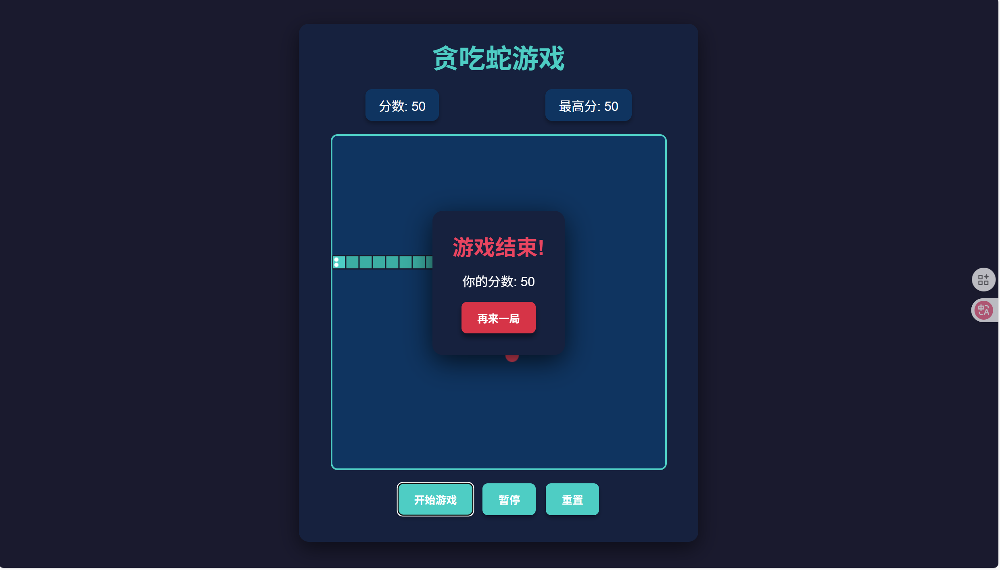

# GitExperiment 项目

这是一个用于Git实验和学习的前端项目，包含基本的HTML、CSS、JavaScript文件结构，以及简单的服务器实现。

## 项目结构

```
├── README.md          # 项目说明文档
├── img/               # 图片资源文件夹
│   ├── 069f25ea9b76b0404989921b968236a4.png
│   └── 48354ca2130f0872ca4cda91d2af2368.png
├── index.html         # 主页面
├── style.css          # 样式文件
├── script.js          # JavaScript脚本
├── server.js          # 简单的服务器实现
├── pl2300_action.json # 动作配置文件
└── testByText.txt     # 测试文本文件
```

## 功能说明

- **主页面**：`index.html`提供项目的主要界面展示
- **样式设计**：`style.css`定义了项目的视觉样式
- **交互逻辑**：`script.js`实现了页面的交互功能
- **图片资源**：`img/`文件夹用于存放项目所需的图片资源
- **服务器**：`server.js`可用于本地开发和测试

## 如何运行

1. 确保您已安装Node.js环境
2. 在项目根目录下运行以下命令启动服务器：
   ```bash
   node server.js
   ```
3. 打开浏览器，访问 http://localhost:3000（或服务器配置的其他端口）

## 项目演示





## 开发说明

- 您可以修改`index.html`来调整页面结构
- 更新`style.css`来自定义页面样式
- 编辑`script.js`来实现所需的交互功能
- 将图片资源放在`img/`文件夹中以便在项目中引用

## Git操作指南

此项目设计用于Git学习和实验，您可以在此项目中练习：
- 创建和切换分支
- 提交和推送代码
- 解决冲突
- 合并分支
- 等等Git相关操作

## 注意事项

- 此项目仅用于学习和实验目的
- 请勿在生产环境中直接使用
- 定期备份您的代码